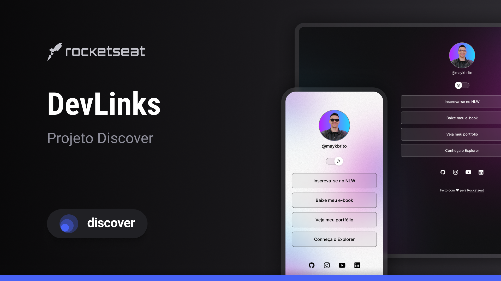

# DevLinks

Programa exclusivo e gratuito, promovido pela [Rocketseat](https://lp.rocketseat.com.br/devlinks/inscricao?utm_source=github&utm_medium=descricao&utm_campaign=capture-devlinks&utm_term=organic&utm_content=descricao-github-mayk-brito) para ensino de tecnologias WEB.

## Tecnologias
Esse projeto foi desenvolvido com as seguintes tecnologias:

- HTML e CSS
- JavaScript
- Git e Github
- Figma

## O projeto
É um agregador de links para usar como cartão de visitas online.
- Acesse meu projeto finalizado [AQUI](https://tetezw.github.io/Perfil/).

## Minhas redes 
- [Linkedin](https://www.linkedin.com/in/tereza-zw/)
- [Github](https://github.com/Tetezw)

## Licença 
Esse projeto está sob a licença MIT.